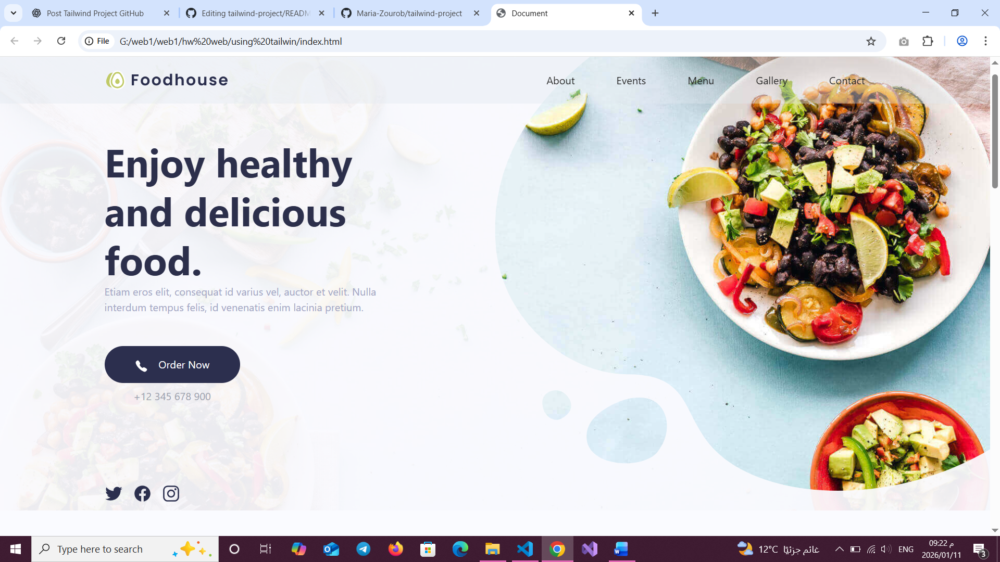
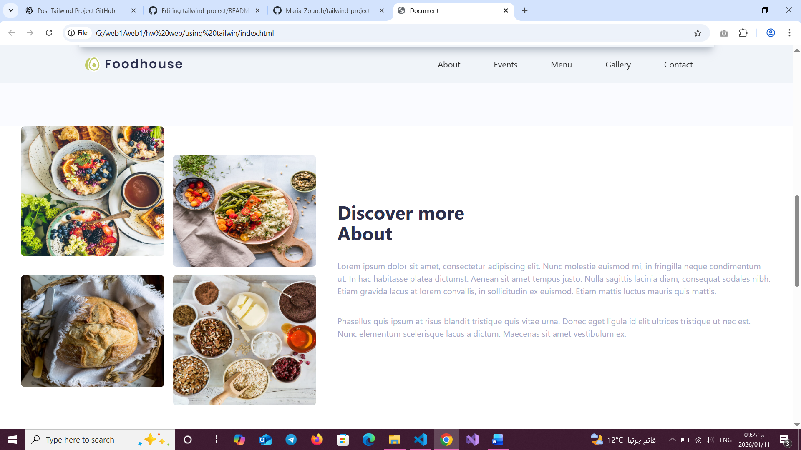
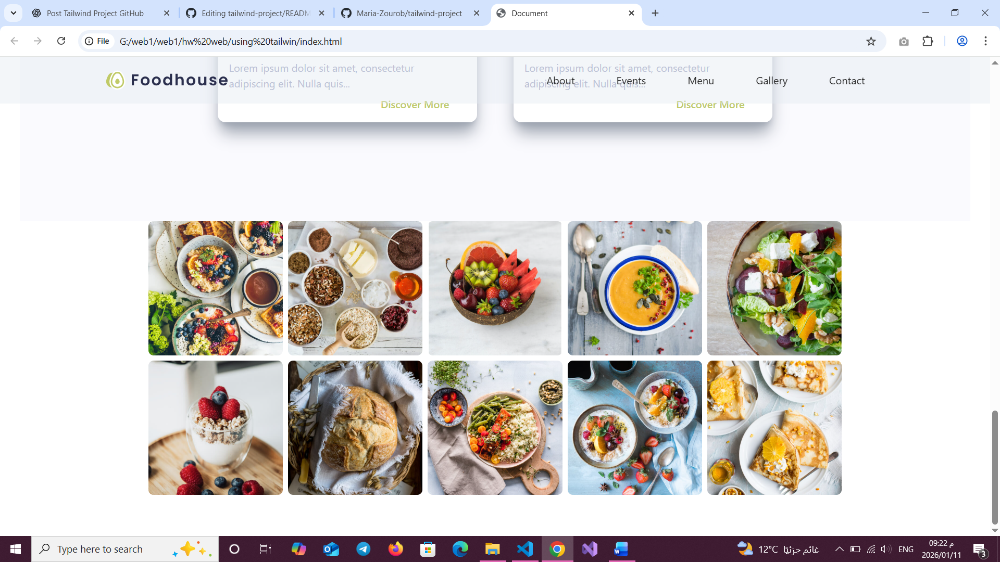
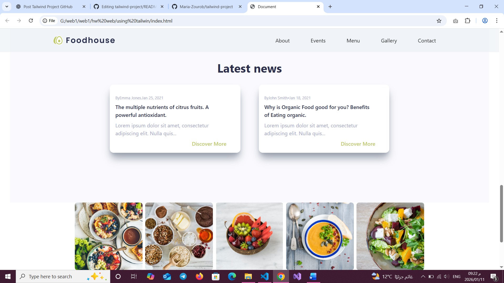

# 🍽️ Foodhouse – Healthy Food Website

**Foodhouse** is a modern, responsive restaurant website designed to promote **healthy and organic food**.  
The project is built using **HTML** and **Tailwind CSS**, focusing on clean UI, smooth layout, and user-friendly design.

---

## 🌟 Website Overview

Foodhouse presents a professional food landing page that includes:
- A hero section with a strong call to action
- Service highlights (quality, organic, delivery)
- About section with image gallery
- Latest news & blog cards
- Food gallery grid
- Clean navigation bar

---

## ✨ Features

- 📱 Fully responsive layout
- 🎨 Styled entirely with **Tailwind CSS**
- 🥗 Healthy & organic food theme
- 🖼️ Image gallery with grid layout
- 📰 Latest news section with cards
- ⚡ Lightweight & fast loading

---

## 🛠️ Technologies Used

- **HTML5**
- **Tailwind CSS**
- **Utility-first CSS**
- **Git & GitHub**

---

## 📁 Project Structure

```text
tailwind-project/
│
├── index.html
├── images/
│   ├── background1.jpg
│   ├── background2.svg
│   ├── logo-foodhouse.svg
│   ├── gallery images...
│
├── README.md
└── .gitignore


## 📸 Screenshots

### 🏠 Home Section


### 🥗 Services Section


### 🖼️ Gallery Section


### 📰 Latest News



▶️ How to Run Locally

Clone the repository:

git clone https://github.com/Maria-Zourob/tailwind-project.git


Open the project folder

Open index.html in your browser

👩‍💻 Author

Maria Zourob
🎓 Computer & Intelligent Systems Engineering Student
💻 Front-End Development Learner

GitHub: @Maria-Zourob

📚 What I Learned

Using Tailwind utility classes effectively

Building responsive layouts

Structuring a clean front-end project

Publishing projects using GitHub & GitHub Pages

⭐ If you like this project, feel free to give it a star!
